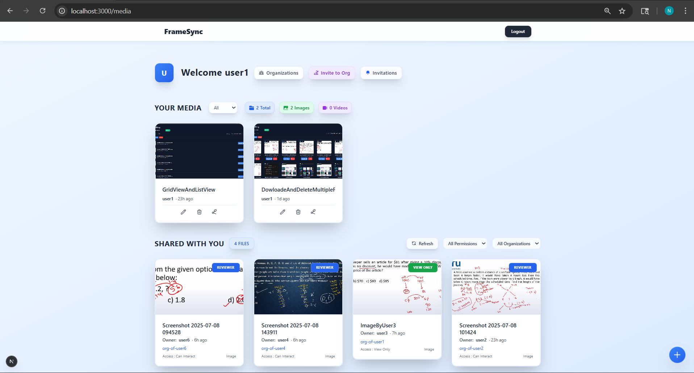
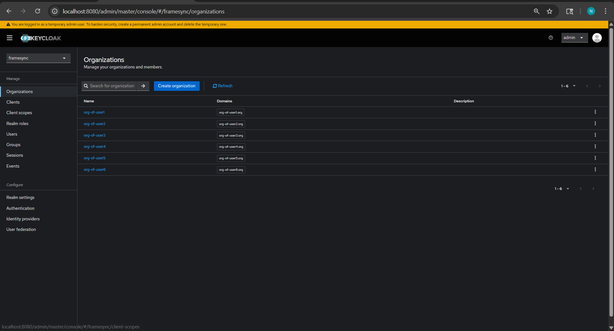

# FrameSync

A full‑stack media collaboration app for uploading media, annotating frames, commenting in real‑time, and managing organizations/invites.

- Frontend: Next.js + Tailwind CSS
- Backend: Node.js/Express + Socket.IO
- Databases: PostgreSQL (metadata), MongoDB (annotations/comments)
- Auth: Keycloak

## Documentation

All docs live under `ABOUT_PROJECT/INFO`:

- Doc Map: [ABOUT_PROJECT/INFO/README.md](ABOUT_PROJECT/INFO/README.md)
- Quickstart: [ABOUT_PROJECT/INFO/QUICKSTART.md](ABOUT_PROJECT/INFO/QUICKSTART.md)
- Architecture: [ABOUT_PROJECT/INFO/ARCHITECTURE.md](ABOUT_PROJECT/INFO/ARCHITECTURE.md)
- Workflows: [ABOUT_PROJECT/INFO/WORKFLOWS.md](ABOUT_PROJECT/INFO/WORKFLOWS.md)
- API Reference: [ABOUT_PROJECT/INFO/COMPLETE_API_DOCUMENTATION.md](ABOUT_PROJECT/INFO/COMPLETE_API_DOCUMENTATION.md)
- Organization Management: [ABOUT_PROJECT/INFO/ORGANIZATION_MANAGEMENT.md](ABOUT_PROJECT/INFO/ORGANIZATION_MANAGEMENT.md)
- Glossary: [ABOUT_PROJECT/INFO/GLOSSARY.md](ABOUT_PROJECT/INFO/GLOSSARY.md)

## Local Development

1) Copy envs
- Client: `client/.env.local`
- Server: `server/.env`

2) Install and run
```bash
# Client
cd client && npm install && npm run dev

# Server
cd ../server && npm install && npm start
```

Open http://localhost:3000

## License

MIT

## Screenshots (from local run)

Below are key screens to help you understand the UX and flows.

### Home and Navigation



- Landing/dashboard with navigation to media library, uploads, organizations, and shared items.

### Media Library and Uploads


- Media library view showing items you’ve uploaded. The upload flow stores files under `server/uploads/` and metadata in PostgreSQL.

### Real-time Collaboration (Client)


- Frontend (Next.js) UI where users open media, add comments and frame/time-based annotations; changes broadcast via Socket.IO.

### Backend Services Overview


- High-level look at the backend services: Express API endpoints, Socket.IO, Postgres, MongoDB, and Keycloak integration.

### Organizations Hub


- Manage organizations, see membership and roles (owner/reviewer/viewer). Read API: `/organizations/user/:userId`, `/organizations/:orgId/members`.

### Invites and Notifications


- Live notifications when you receive org invites. Backed by `/org-invites/pending/:userId` and Socket.IO events.


- Send invites to add users to your organization with a selected role via `POST /org-invites/send`.

### Keycloak Setup Snapshot



- Example of Keycloak realm/organizations configuration used by the app (realm: `framesync`).

### Dockerized Setup


- Optional containerized view of running services for production-like setups.
